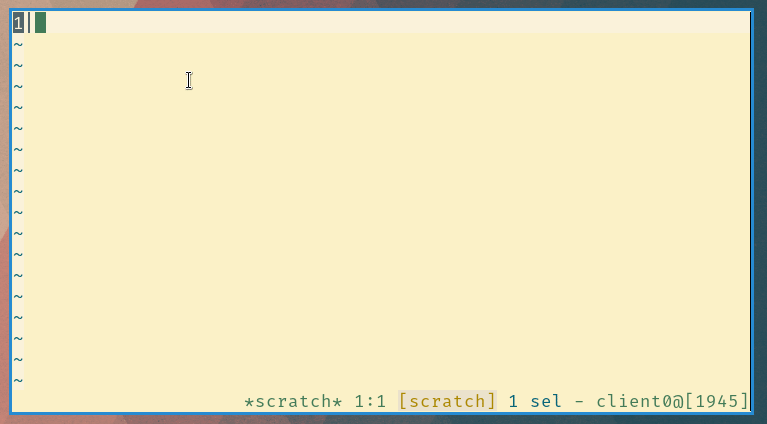

# Kakoune Edit or Dir

Sometimes, when I use `:edit` command in Kakoune, I press enter too
early. Kakoune complains `foo is a directory`. I know Kakoune, thank you
very much. What if editing directory would show you interactive file browser
instead?

## GIF time!



## Installation

Source `edit-or-dir.kak` from your `kakrc` or let your plugin manager do
the job. For convenience I recommend aliasing `:edit-or-dir` command to `:e`.
I **do not** recommend aliasing or overriding built-in `:edit` command, since
it might broke other scripts. Replacing `:e` alias is fine, scripts should
not relay on aliases anyway.

```
unalias global e edit
alias global e edit-or-dir
```

## Usage

```
edit-or-dir [PATH]

PATH - relative or absolute path to file or directory.
       . means current directory
       .. means parent directory
       If PATH is directory, file browser in temporary buffer *dir* will be opened
```

When in `*dir*` buffer you can use following bindings:

- <kbd>Return</kbd>: Open selected files
- <kbd>Backspace</kbd>: Go to parent directory
- <kbd>Alt</kbd> <kbd>h</kbd>: Toggle hidden files
- <kbd>Escape</kbd>: Close file browser

You can open multiple files by selecting them with <kbd>x</kbd> or other
selection method like <kbd>%</kbd><kbd>s</kbd>regex<kbd>Return</kbd>

## Related plugins

- [alexherbo2][alexherbo2]/[edit-directory.kak][edit-directory.kak]
- [occivink][occivink]/[kakoune-filetree][kakoune-filetree]

## Changelog

- 0.1 2018-09-26:
  - Kakoune [v2018.09.04]
  - Initial release
- 0.2 2018-09-27:
  - _FIX_ Replace `basename` with substitution, PR [#1]
- 0.3 2018-09-28:
  - _ADD_ Hidden files toggle, PR [#2]
  - _ADD_ New bindings, PR [#2]
  - _ADD_ [EditorConfig] for developers
  - _FIX_ Remove new line from end of `*dir*` buffer
  - _FIX_ Apply changes proposed by [ShellCheck]
- master
  - _ADD_ support to edit multiple files, PR [#4]
  - _ADD_ CONTRIBUTING document, PR [#4]
  - _ADD_ edit-or-dir-{forward,back} internal (hidden) commands, PR [#4]
  - _FIX_ Fix Typos, improve style and formatting of README, PR [#4]
  - _CHANGE_ rename edit-or-dir-display-dir (internal command, not breaking), PR [#4]
  - _CHANGE_ refactoring, PR [#4]


[EditorConfig]: https://editorconfig.org
[ShellCheck]: https://shellcheck.net
[v2018.09.04]: https://github.com/mawww/kakoune/releases/tag/v2018.09.04
[#1]: https://github.com/TeddyDD/kakoune-edit-or-dir/pull/1
[#2]: https://github.com/TeddyDD/kakoune-edit-or-dir/pull/2
[#4]: https://github.com/TeddyDD/kakoune-edit-or-dir/pull/4

[alexherbo2]: https://github.com/alexherbo2
[edit-directory.kak]: https://github.com/alexherbo2/edit-directory.kak
[occivink]: https://github.com/occivink
[kakoune-filetree]: https://github.com/occivink/kakoune-filetree

